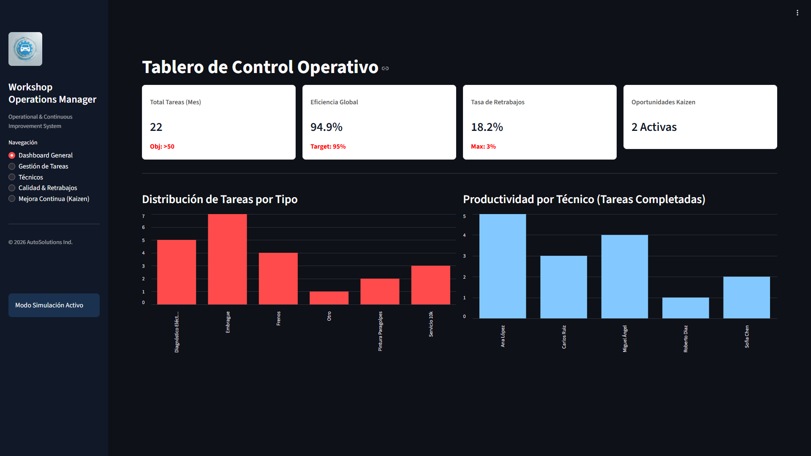
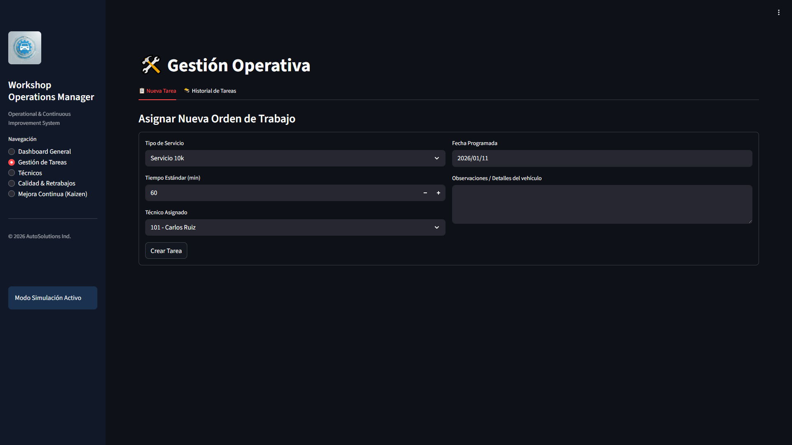
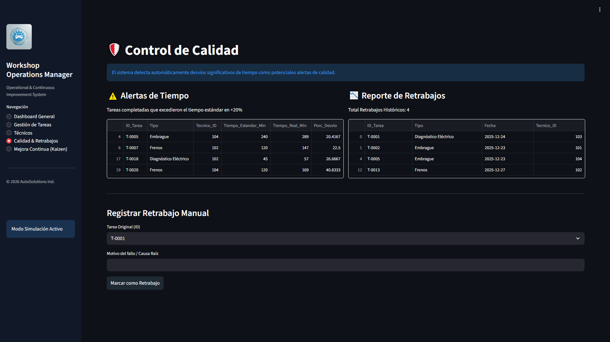

Automotive Workshop Kaizen Dashboard
Overview

Automotive Workshop Kaizen Dashboard is a lightweight operational management application designed for automotive workshops and technical service environments.

The application combines Kaizen principles, basic operational analytics, and visual management to help supervisors, trainers, and technical leaders monitor daily activity, detect inefficiencies, and promote continuous improvement.

This project was developed as part of a professional portfolio to demonstrate experience in operational leadership, process optimization, data-driven thinking, and technical training support tools.

Purpose

Many automotive workshops rely on informal task tracking, verbal coordination, or fragmented spreadsheets.
This project explores how a simple digital tool can improve visibility and decision-making without adding unnecessary complexity.

The dashboard is designed to help:

Organize daily operational tasks

Monitor workload and task status

Identify inefficiencies and rework

Support continuous improvement initiatives

Serve as a training and leadership support tool

Key Features

Task Management
Allows registration and visualization of workshop tasks, including service type, assigned technician, planned time, and current status.

Operational Metrics
Provides a visual overview of task distribution, basic productivity indicators, and operational flow to support quick decision-making.

Kaizen-Oriented Approach
Designed around continuous improvement concepts, encouraging visibility of problems, accountability, and incremental optimization.

Training and Leadership Use
The application can be used in technical training sessions, leadership workshops, or internal improvement initiatives to explain operational metrics and process thinking.

Technologies Used

Python

Streamlit for interactive web application development

Pandas for data handling and transformation

Altair for data visualization

Project Structure

Below is the current project structure. This layout is intentionally simple to make the project easy to review and run locally.

automotive-workshop-kaizen-dashboard/
│
├── app.py
│   Main Streamlit application file
│
├── requirements.txt
│   Python dependencies required to run the app
│
├── README.md
│   Project documentation
│
├── implementation_plan.txt
│   Initial design and functional planning
│
├── walkthrough.txt
│   Explanation of application logic and usage
│
└── assets/
    Optional folder for images or future UI resources

How to Run the Project Locally

Clone the repository

Create and activate a virtual environment

Install dependencies using requirements.txt

Run the application using Streamlit

Example:

streamlit run app.py

Use Cases

Automotive workshop supervision

Technical training and education

Process improvement demonstrations

Leadership and operational management portfolios

Application Screenshots

### Dashboard Overview

### Task Management

### Continuous Improvement (Kaizen)

### Quality & Rework Control

Author

Alexis Gerez
Technical Trainer | Automotive Operations | Data Analysis & Process Improvement